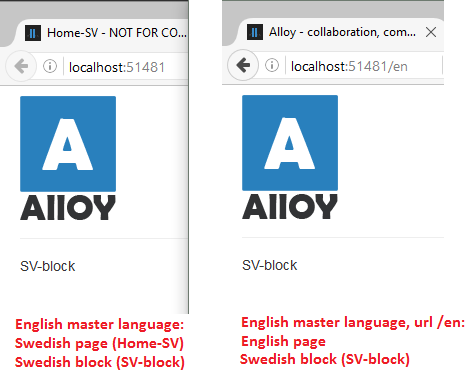

# AlloyDemoKit

Translation problem:
There is a difference between http://localhost:51481 and http://localhost:51481/en even though we force the language to "sv" 



We see "sv" blocks on both pages (because of the updatelanguage), however on "http://localhost:51481" we get english page properties, on "/en" we get swedish page properties.
Ergo: it is not possible to overwrite the language in a correct way using the IUpdateCurrentLanguage.

Forcing a different language by using the IUpdateCurrentLanguage does not work.
If you look at the MultiplexingRouteHandler it makes sense as it does not retrieve new language after calling UpdateLanguage.
```csharp
public class MultiplexingRouteHandler : IRouteHandler 
{ 
... 
public virtual IRouteHandler GetRouteHandler(RequestContext requestContext) 
{
//this happens if we go to http://localhost:51481/en
string language = requestContext.GetLanguage(); //language == "en" 
this._updateCurrentLanguage.UpdateLanguage(language);// changes "en" to "sv" 
object routedData = this.GetRoutedData(requestContext, language); // still using "en" to get route data, but other code (executed later) will use "sv" because of UpdateLanguage 
return this.GetRouteHandlerOrRedirect(requestContext, routedData, true); 
} 
... 
}
```